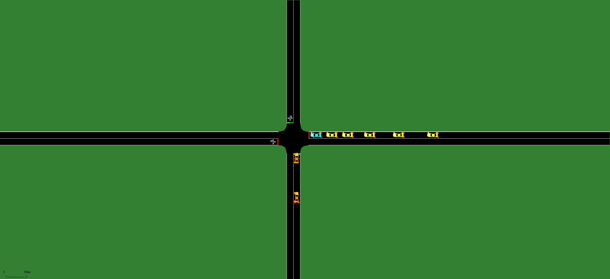
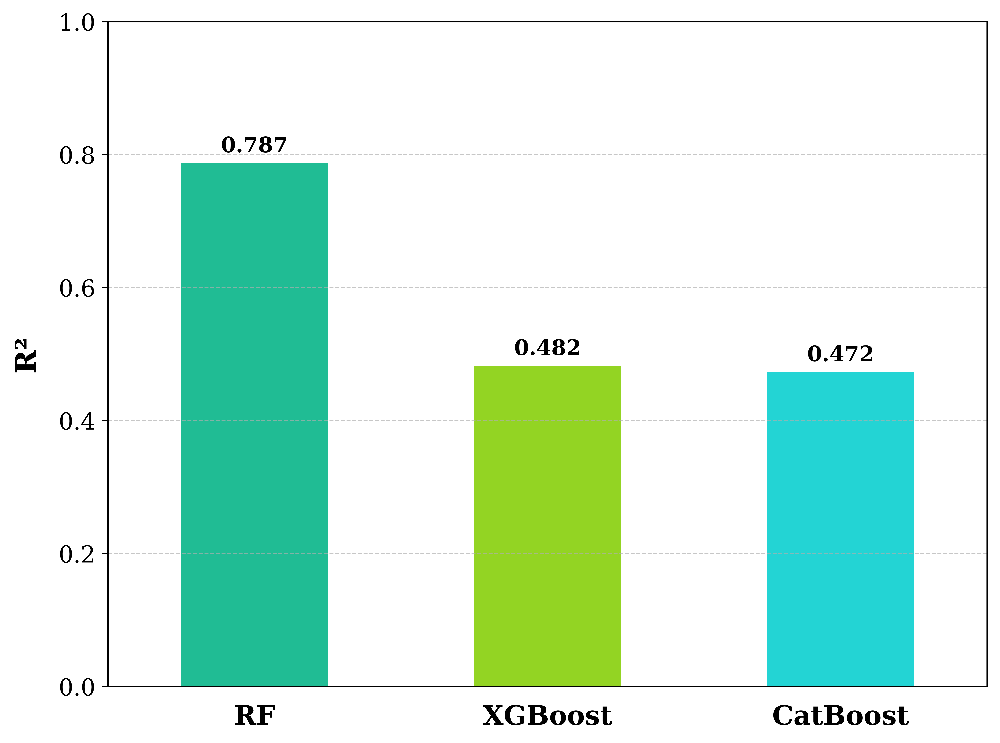

# Optimizing-V2V-Communication-Delay-Prediction-in-CAV-Vehicles-through-SUMO-and-ns-3-Simulations
Integration of SUMO mobility and ns3 wireless simulation is used to predict V2V delay in CAV platoons. Using 802.11p data and ML models like RF and XGBoost, delays are predicted from speed, distance, and RSSI. Results show accurate delay prediction for safer and more efficient CAV networks.

# Algorithm: SIMULATESUMO
This algorithm describes the procedure for simulating a 3x3 grid network with Connected and Autonomous Vehicle (CAV) platoons in SUMO.

# Algorithm 1: SIMULATESUMO(N, G, P, T, Δt)

**Require:**
- N = total number of vehicles
- G = grid size (3×3, 400 m)
- P = number of platoons (6 platoons × 5 vehicles)
- T = 100 s (total simulation time)
- Δt = 0.1 s (simulation step length)

**Ensure: Vehicle trajectories, platoon dynamics, emission data (fcd-output)**

- 1: Generate SUMO network net.xml with grid size G
- 2: Define vehicle type cav with attributes (length, max speed, accel, decel, σ)
- 3: Create 6 predefined routes (route1–route6) across grid edges
- 4: Assign 5 vehicles to each platoon with staggered departures (0–28 s)
- 5: Save vehicle and route definitions in road.rou.xml
- 6: Create configuration file road.sumocfg linking net.xml and rou.xml
- 7: Set simulation parameters: begin=0, end=100, step=0.1
- 8: Specify output file fcd-output.xml for full vehicle trajectories
- 9: Run SUMO simulation with sumo -c road.sumocfg
- 10: Collect outputs: positions and speeds for all platoons
- 11: Post-process to evaluate traffic performance and platoon stability
- 12: Return trajectory data (fcd-output.xml)

# Network Simulation in ns-3

- Imported SUMO mobility trace (CSV) into ns-3 to emulate V2V/V2X communication.
- Each vehicle mapped to a dedicated ns-3 node with ConstantPositionMobilityModel.
- Updated vehicle positions dynamically at simulation runtime using SUMO trace scheduling.
- Configured wireless communication with IEEE 802.11p standard at 5.9 GHz.
- Implemented socket-based communication between every sender–receiver vehicle pair.
- Simulated periodic packet transmissions (every 0.1 s) with embedded sender ID and timestamp.
- Collected key performance parameters in output [CSV](ns3-output.csv): Time, SenderID, ReceiverID, Distance, SpeedSender, SpeedReceiver, PacketSize, RSSI, Delay, PacketLoss.
# Feature Engineering and Preprocessing
- Removed records with zero distance to avoid bias in delay estimation.
- Dropped irrelevant fields (PacketSize, PacketLoss, SenderID, ReceiverID).
- Selected final features: Time, Distance, SpeedSender, SpeedReceiver, RSSI.
- Target variable: Delay (ms).
- Normalized dataset and split into training (80%) and testing (20%).

# Result Section 

**Compared RF, XGBoost, and CatBoost performance(LINK)**
| Model             | MSE       | RMSE   | MAE   | R² Score | CV Mean RMSE | CV Std RMSE |
| ----------------- | --------- | ------ | ----- | -------- | ------------ | ----------- |
| **Random Forest** | 16,169.63 | 127.16 | 36.87 | 0.7868   | 172.84       | 211.91      |
| **XGBoost**       | 39,308.54 | 198.26 | 59.26 | 0.4818   | 173.61       | 205.33      |
| **CatBoost**      | 40,013.12 | 200.03 | 60.32 | 0.4725   | 172.36       | 204.43      |

Identified Random Forest as the best-performing model (based on R² and RMSE).

  
